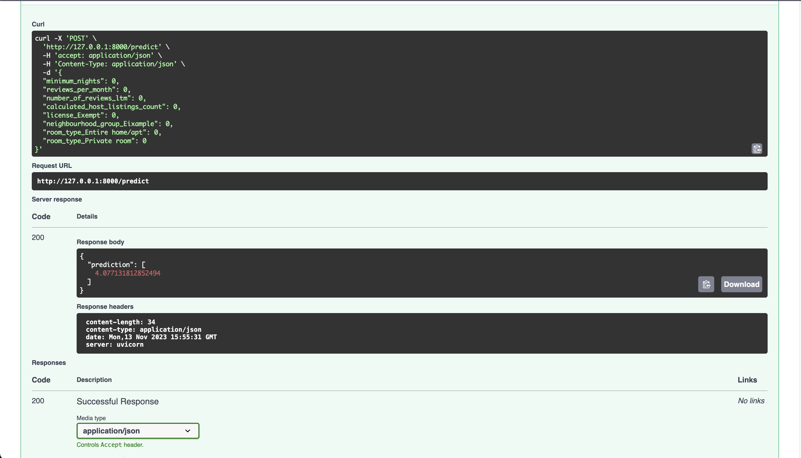

# MlOPS learning project
Collection of readmes regarding used tools.

# Diagram


## Mlflow tracking UI
Deploys MLFLOW tracking UI to AWS cloud. Dependencies:
- AWS App Runner to host tracking UI
- AWS RDS Postgre as mflow persistent layer
- AWS S3 as storage for storing runs artifacts


### Deploy to AWS
1. Configure AWS credentails - https://docs.aws.amazon.com/cli/latest/userguide/cli-chap-configure.html
2. Execute next commands:
```bash
> cd terraform/apps/mlflow
> terraform init
> terraform apply
```

This will create RDS instance, s3 bucket and App Runner serivce from Mlflow image with public endpoint (with basic-auth)

### Scalr
Scalr is a remote operations backend for Terraform and OpenTofu (OTF). Scalr executes runs and stores state centrally allowing for easy collaboration across your organization.

Deployment of mlflow via Scalr


### Optional
You can create billing alarm for AWS via next steps:
```bash
> cd terraform/apps/cloudwatch
> terraform init
> terraform apply
```
This will create billing alarm for 3.33$ usage per day (approx. 100$ per month)

### Local setup
You can spin up local instance of mlflow via docker-compose.
In order to do that execute next command from the root directory of the repo:
```bash
docker-compose --file local-dev/local-docker-compose.yaml  up
```

This method does not store any persistant data, so it is only applicable for local dev/test purposes.


## Run training

To run training of the model: 
1. Export neccesary envirement variables for the train.py:
```bash
export MLFLOW_TRACKING_URI="Change me"
export MLFLOW_EXPERIMENT_NAME="Change me"
export MLFLOW_TRACKING_USERNAME="Change me"
export MLFLOW_TRACKING_PASSWORD="Change me"

export AWS_ACCESS_KEY_ID="Change me"
export AWS_SECRET_ACCESS_KEY="Change me"
```
2. Run train.py:
```bash
python train.py
```
The experiment will be track by mlflow, the artifact will be upload to S3 bucket.

## Deployment
### Locally
1. Enter needed env variables for running model (via deployment/env file)
2. Go to deployment folder:
```bash
> cd deployment
```
3. Run docker build:
```bash
> docker build -f Dockerfile -t model .
```
3. Run docker container:
```bash
docker run -it --rm -p 5001:80 --env-file env  model
```

This will serve the model via FastAPI. To trigger predict endpoint go to localhost:5001/docs and run request to /predict endpoint via OpenAPI UI.



